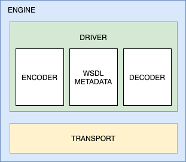

# SOAP Engine

This package contains the contracts and models that allow you to create a customizable SOAP engine.
The design looks like this:




* **Driver:** A driver is a combination of an encoder + decoder + metadata that can work together in order to process SOAP requests.
  * **Encoder:** Can encode mixed data into a valid SOAP Request. 
  * **Decoder:** Can decode a SOAP Response into a mixed data result.
  * **Metadata:** Processes the WSDL and returns a collection of available types and methods.
* **Transport:** Sends the HTTP SOAP Request and receives the HTTP SOAP Response.

Every component above can be used seperately in order to create your own customized SOAP Engine.

# Want to help out? 💚

- [Become a Sponsor](https://github.com/php-soap/.github/blob/main/HELPING_OUT.md#sponsor)
- [Let us do your implementation](https://github.com/php-soap/.github/blob/main/HELPING_OUT.md#let-us-do-your-implementation)
- [Contribute](https://github.com/php-soap/.github/blob/main/HELPING_OUT.md#contribute)
- [Help maintain these packages](https://github.com/php-soap/.github/blob/main/HELPING_OUT.md#maintain)

Want more information about the future of this project? Check out this list of the [next big projects](https://github.com/php-soap/.github/blob/main/PROJECTS.md) we'll be working on.

# Installation

```shell
composer install php-soap/engine
```

## Engines

This package provides engines that can be used in a generic way:

### SimpleEngine

The SimpleEngine is a wrapper around a previous defined `Driver` and a `Transport` implementation.

```php
use Soap\Engine\SimpleEngine;

$engine = new SimpleEngine($driver,$transport);
```

### LazyEngine

You don't want to be loading WSDL files or SOAP services if you don't need to.
By wrapping an engine in a lazy engine, you can prevent any WSDL loading from happening before actually requesting a resource.

```php
use Soap\Engine\SimpleEngine;
use Soap\Engine\LazyEngine;

$engine = new LazyEngine(fn () => new SimpleEngine($driver, $transport));
```

## Drivers

This package provides drivers that can be used in a generic way:

### SimpleDriver

The SimpleEngine is a wrapper around a previous defined `Encoder`, `Decoder` and a `Metadata` implementation.

```php
use Soap\Engine\SimpleDriver;

$engine = new SimpleDriver($encoder, $decoder, $metadata);
```

### PartialDriver

The PartialDriver is a wrapper around a previous defined `Encoder`, `Decoder` and a `Metadata` implementation.
It is possible to only provide one of the required items. 
When some of the implementations are missing, it will throw a `DriverException` when the driver's method is invoked.

```php
use Soap\Engine\PartialDriver;

$engine = new PartialDriver(metadata: $metadata);
```

## List of available components:

* [cached-engine](https://github.com/php-soap/cached-engine/): Provides wrappers for storing engines and encoders in a PSR-6 Cache pool.
  * **CachedDriver**: Decorates a cache around a driver factory.
  * **CachedEngine**: Decorates a cache around an engine factory.

* [ext-soap-engine](https://github.com/php-soap/ext-soap-engine): An engine based on PHP's ext-soap.
  * **ExtSoapEncoder:** Uses PHP's `SoapClient` in order to encode a mixed request body into a SOAP request.
  * **ExtSoapDecoder:** Uses PHP's `SoapClient` in order to decode a SOAP Response into mixed data.
  * **ExtSoapMetadata:** Parses the methods and types from PHP's `SoapClient` into something more usable.  
  * **ExtSoapDriver:** Combines the ext-soap encoder, decoder and metadata tools into a usable `ext-soap` preset. 
  * **ExtSoapClientTransport:** Uses PHP's `SoapClient` to handle SOAP requests.
  * **ExtSoapServerTransport:** Uses PHP's `SoapServer` to handle SOAP requests. 
  * **TraceableTransport:** Can be used to decorate another transport and keeps track of the last request and response.
    

* [psr18-transport](https://github.com/php-soap/psr18-transport/): Leverages your PSR-18 HTTP client to deal with the HTTP Layer.
  * **Psr18Transport**: Uses a PSR-18 HTTP client to handle SOAP requests. You can also use fiber-based Async clients!
  * Provides middleware to deal with some common SOAP quirks.


* [wsdl-reader](https://github.com/php-soap/wsdl-reader/): Provides an XML based PHP implementation for collecting WSDL meta-data.
  * **Wsdl1MetadataProvider**: Provides the methods and types from any WSDL 1 document.

## Creating your own engine

Every component of the engine has its own interface.
You can choose to build an entire engine or a specific component.
The interfaces look like this:

* [Decoder](src/Decoder.php)
* [Driver](src/Driver.php)
* [Encoder](src/Encoder.php)
* [Engine](src/Engine.php)
* [Transport](src/Transport.php)


### Testing your engine

To make sure that all components have the same end-result, we provide [a set of integration tests](https://github.com/php-soap/engine-integration-tests) that can be used to test your custom components.

Usage:

```
composer require --dev php-soap/engine-integration-tests
```

This will make following test cases available:

* [AbstractDecoderTest](https://github.com/php-soap/engine-integration-tests/tree/main/src/AbstractDecoderTest.php): Can be used to test a custom `Decoder`.
* [AbstractEncoderTest](https://github.com/php-soap/engine-integration-tests/tree/main/src/AbstractEncoderTest.php): Can be used to test a custom `Encoder`.
* [AbstractEngineTest](https://github.com/php-soap/engine-integration-tests/tree/main/src/AbstractEngineTest.php): : Can be used to test a custom `Engine` or `Transport`.
* [AbstractMetadataProviderTest](https://github.com/php-soap/engine-integration-tests/tree/main/src/AbstractMetadataProviderTest.php): : Can be used to test a custom `Metadata` or `MetadataProvider`.
